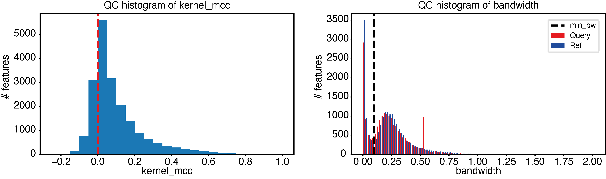
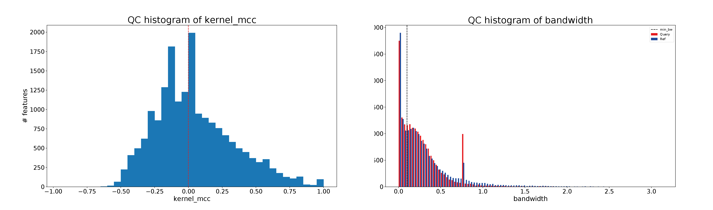
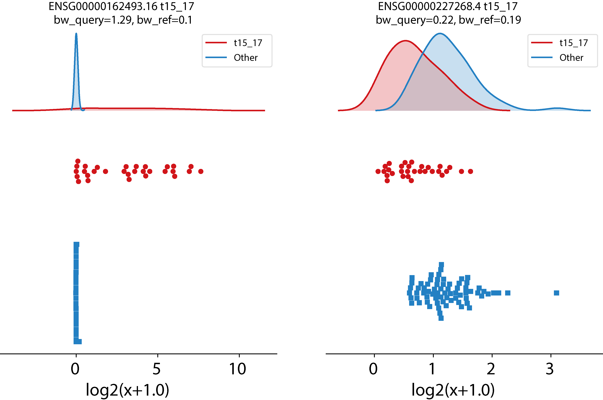

First steps with EPCY
=====================

EPCY is implemented in python3 and allows to perform predictive
analyses using bash command line.

If it's not already done, you need to install EPCY

.. code:: bash

   pip install epcy
   epcy -h

Input files
-----------

EPCY is designed to work on several quantitative data (like genes
expression), provided that this data is normalized, that is
quantitative values for each genes (features) need to be comparable
between each samples.  **PG: For RNA-seq data, TPM, FPKM or even counts per
million reads (CPM) values would be appropriate (normalization per
transcript length is not critical since we will be comparing
quantities between samples, not within samples).**

To run EPCY, you need two **tabulated** files, as input:

  * A **matrix of quantitative data**, normalized for each samples (in columns)
    with an *ID* column to identify each genes (features), in first.

  .. list-table:: Example of a quantitative matrix
       :widths: 30 20 20 20
       :header-rows: 1

       * - id
         - Sample1
         - ...
         - SampleX
       * - Gene1
         - 10
         - ...
         - 20
       * - ...
         - ...
         - ...
         - ...
       * - GeneY
         - 12
         - ...
         - 16

  * A **design table** which describes the parameters or conditions on
    which to perform the analyses. This table is composed of a first
    column *Sample*, followed by at least one column which describes
    each sample for each parameter. A new column is needed for each
    parameter.  For a gene knock-out experiment for instance, a column
    would indicate which samples are wild-type and which is knock-out.

  .. list-table:: Example of a design table
     :widths: 30 20 20
     :header-rows: 1

     * - sample
       - Condition1
       - Gender
     * - Sample1
       - WT
       - M
     * - ...
       - ...
       - ...
     * - SampleX
       - KO
       - F

Download input files
--------------------

For this tutorial, we propose to download a part of the Leucegene
cohort composed by 100 Acute Myeloid Leukemia (AML) individual
samples. To reduce the execution time, we are going to only analyze
coding genes (19,892 genes).  These input files are available within the EPCY
source code, and can be downloaded using *git*:

**PG: ilmanquerait le repo dans le code qui suit:**

.. code:: bash

   git clone 
   cd epcy/data/leucegene3

If you examine the *design.txt* file, you can see that an *AML* column
is used to classify each sample into one of these 3 subtypes of AML:
*t15_17*, *inv16* and *other*.  These refer to samples that show
either a chromosome 15-17 translocation, a chromosome 16 inversion or
other defect respectively.

  .. list-table:: design.txt
     :widths: 30 20
     :header-rows: 1

     * - Sample
       - AML
     * - 01H001
       - Other
     * - 01H002
       - t15_17
     * - ...
       - ...
     * - 14H103
       - inv16
     * - 14H133
       - t15_17

We will start by comparing *t15_17* samples versus all other samples (*inv16* and
*other*). On a macbook pro 2 GHz Dual-Core Intel Core i5, this analysis takes
8 min, using 4 thread.

Run your first EPCY analysis
----------------------------

EPCY is divided into severals tools, which can be listed using:

.. code:: bash

   epcy -h

Among all these tools, *epcy pred* is the one which allows to run a default
comparative predictive analysis.  In our current case, we would write:

.. code:: bash

   epcy pred --log -t 4 -m cpm.xls  -d design.txt --subgroup AML --query t15_17 -o ./30_t15_17_vs_70/

where:
  * **-\-log**: specifies that quantitative data needs to to be log transformed
    before being analyzed.
  * **-t 4**: allows to use 4 threads for the analysis.
  * **-m cpm.xls**: specifies the quantitative matrix file.
  * **-d design.txt**: specifies the design table.
  * **-\-subgroup AML**: determines the condition column we want use.
    **PG: c'est la première fois qu'on réfère à la colonne condition
    comme un subgroup...**
  * **-\-query t15_17**: specifies which subgroup of AML samples we want to compare to all the other.
  * **-o ./30_t15_17_vs_70/**: specifies the output directory.

More information can be found, using *epcy pred -h*.

If everything is correct, the analysis will complete by displaying the following output:

.. code:: bash

   16:31:24: Read design and matrix features
   16:31:34: Start epcy analysis of 19892 features
   16:39:48: Save epcy results
   16:39:49: End

Results
-------

**predictive_capability.xls** is the main output of an EPCY
analysis. It is a tabulated file which contains the evaluation of each
genes (features) for its predictive value, using 9 columns:

* **id**: the id of each gene (feature).
* **l2fc**: log2 fold change.
* **kernel\_mcc**: Matthews Correlation Coefficient (`MCC`_) compute by a predictor using `KDE`_.
* **kernel\_mcc\_low**: lower bound of the confidence interval (90%).
* **kernel\_mcc\_high**: upper bound of the confidence interval (90%).
* **mean\_query**: average values of this feature for samples in the subgroup of interest defined using the --query parameter.
* **mean\_ref**: average values of this feature for samples in the reference group (not in the query subset).
* **bw\_query**: estimated bandwidth used by `KDE`_, to calculate the density of query samples.
* **bw\_ref**: estimated bandwidth used by `KDE`_, to calculate the density of ref samples.

Genes (features) with the highest *kernel_mcc* values correspond to
the most prodictive ones. The file may then be sorted on that column
to obtain the following:

.. list-table:: ./30_t15_17_vs_70/predictive_capability.xls ordered on kernel_mcc
   :widths: 30 10 15 20 20 15 15 15 15
   :header-rows: 1

   * - id
     - l2fc
     - kernel_mcc
     - kernel_mcc_low
     - kernel_mcc_high
     - mean_query
     - mean_ref
     - bw_query
     - bw_ref
   * - ENSG00000089820.15
     - -4.30
     - 0.96
     - 0.51
     - 0.97
     - 4.23
     - 8.53
     - 0.43
     - 0.22
   * - ENSG00000168004.9
     - 3.64
     - 0.91
     - 0.82
     - 0.95
     - 3.90
     - 0.26
     - 0.29
     - 0.10
   * - ENSG00000173531.15
     - 3.23
     - 0.90
     - 0.59
     - 0.97
     - 6.22
     - 2.99
     - 0.52
     - 0.21
   * - ...
     - ...
     - ...
     - ...
     - ...
     - ...
     - ...
     - ...
     - ...

Note: Since EPCY uses some random steps in its implementation, you may
observe small variations in your results. The argument *-\- randomseed
42* can be used to obtain the exact same results (see Reproductibility
section).

Quality control
---------------

EPCY needs to have enough data to train the KDE classifier and evaluate
the predictive capability of each gene (feature) accurately.
Without enough samples, EPCY will `overfit`_ and return a large number
of negative MCC.

Unfortunately, it is *a priori* difficult to detemine a lower bound
for the number samples needed, as this number will depend on the
dataset analyzed.  However, EPCY provides some quality control tools (*epcy
qc*), to verify if there is `overfitting`_ or not, by checking the
distribution of MCC and `bandwidth`_.

Using *epcy qc*, we can plot two quality control figures, as follow:

.. code:: bash

   epcy qc -p ./30_t15_17_vs_70/predictive_capability.xls -o ./30_t15_17_vs_70/qc

We can see in these graphs that quality is good, since:

* Most negative MCC, are close to 0.
* The minimum bandwidth (default 0.1), avoids learning from variations represented
  by the first mode of the distribution.

An example of bad quality control results can be made by simulating a dataset that is too small, as follows:

.. code:: bash

   epcy pred --log -t 4 -m cpm.xls  -d design_10_samples.txt --subgroup AML --query t15_17 -o ./5_t15_17_vs_5/
   epcy qc -p ./5_t15_17_vs_5/predictive_capability.xls -o ./5_t15_17_vs_5/qc

	  
Plot a KDE trained on gene expression
-------------------------------------

EPCY also provides some visual tools, which can help with the
exploration of your dataset.  Using *epcy profile*, we can plot the
gene expression distribution, along with the trained KDE classifier
that represents each condition.

.. code:: bash

   # ENSG00000162493.16 (PDPN, MCC=0.87), ENSG00000227268.4 (KLLN, MCC=0.33)
   epcy profile --log -m cpm.xls -d design.txt --subgroup AML --query t15_17 -o ./30_t15_17_vs_70/figures/ --ids ENSG00000162493.16 ENSG00000227268.4

Reproducibility
---------------

EPCY draws a random value to assign a class according to probabilities learned
by the KDE classifier, to fill a contingency table (see algorithme section).
This means that different runs of EPCY can produce different results.

However, the output of EPCY is relatively stable, since each
predictive score returned is already a mean of several predictive
score calculations (by default 100), which are performed to minimize
variance between runs. Nevertheless, different runs might show small
variations.  To ensure reproducibility, we add a parameter to specify
the seed of the random number generator, using **-\-randomseed**.

Here is an example on the dataset used for the tutorial (see, How to use EPCY).

.. code:: bash

  epcy pred --randomseed 42 --log -t 4 -m cpm.xls  -d design.txt --subgroup AML --query inv16 -o ./30_inv16_vs_70/

Some details on the design table
--------------------------------

As mentioned before, the *design.txt* file classifies samples in 3 different
subtypes (*t15_17*, *inv16* and *other*). Similarly as we did for *t15_17*, we
can analyse *inv16* samples vs all others samples (*t15_17* and
*other*), using the command below:

.. code:: bash

   epcy pred --log -t 4 -m cpm.xls  -d design.txt --subgroup AML --query inv16 -o ./30_inv16_vs_70/

Moreover, it is possible to add more columns in **design.txt**, each
one representing conditions you want to compare. Indeed, with the
design table given as example (in introduction), we could perform an
analysis on **Gender**, using *-\-subgroup Gender -\-query M -o
./gender*.

Also, if some annotations are unknown for some samples, we can remove these
samples from the analysis by using **None** in the corresponding cell.

  .. list-table:: Example where the AML subtype of sampleX is unknown and
                  needs to be removed from the analysis.
     :widths: 30 20 20
     :header-rows: 1

     * - Sample
       - AML
       - Gender
     * - Sample1
       - t15_17
       - M
     * - ...
       - ...
       - ...
     * - SampleX
       - None
       - F

With all these variations, you should be able to perform any number of
comparisons using a unique design file, or by creating a different design file
for each comparison.

.. _MCC: https://en.wikipedia.org/wiki/Matthews_correlation_coefficient
.. _KDE: https://en.wikipedia.org/wiki/Kernel_density_estimation
.. _overfit: https://en.wikipedia.org/wiki/Overfitting
.. _overfitting: https://en.wikipedia.org/wiki/Overfitting
.. _bandwidth: https://en.wikipedia.org/wiki/Kernel_density_estimation#Bandwidth_selection
