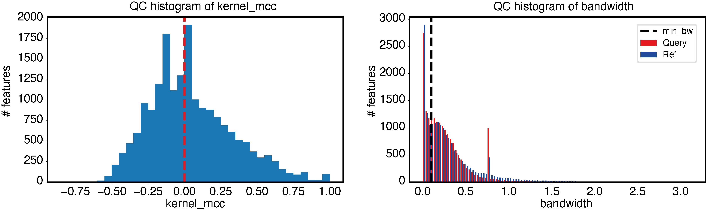

First steps with EPCY
=====================

We have implemented EPCY in python3 as a software, which allow you to perform
predictive analyses using bash command line.

If it's not already done, you need to install EPCY

.. code:: bash

   pip install epcy
   epcy -h

Input files
-----------

EPCY is design to work on severals quantitative data (like genes expression),
provided that data are normalized: quantitative values of each genes (features)
need to be comparable between each samples.

To run EPCY, we need two **tabulated** files, as input:

  * A **matrix of quantitative data**, normalized for each samples (in columns)
    with an *ID* column to identify each genes (features), in first.

  .. list-table:: Example of a quantitative matrix
       :widths: 30 20 20 20
       :header-rows: 1

       * - ID
         - Sample1
         - ...
         - SampleX
       * - Gene1
         - 10
         - ...
         - 20
       * - ...
         - ...
         - ...
         - ...
       * - GeneY
         - 12
         - ...
         - 16

  * A **design table** which describe all comparisons to analyse. This
    table is composed by a first column *Sample*, followed by at least one
    column to assign observed labels for each samples. A new column is needed
    for each conditions.

  .. list-table:: Example of a design table
     :widths: 30 20 20
     :header-rows: 1

     * - Sample
       - Condition1
       - Gender
     * - Sample1
       - Query
       - M
     * - ...
       - ...
       - ...
     * - SampleX
       - Ref
       - F

Download input files
--------------------

For this tutorial, we propose to download a part of the
Leucegene cohort composed by 100 Acute Myeloid Leukemia (AML) individual
samples. To reduce the execution time, we are going to analyze only genes that
code for a protein (19,892 genes).
These input file are available in EPCY source code, using *git*:

.. code:: bash

   git clone
   cd epcy/data/leucegene3

If you take a look of *design.txt*, you can see an *AML* column which
classify each samples in one of these 3 subtypes of AML:
*t15_17*, *inv16* and *other*.

  .. list-table:: design.txt
     :widths: 30 20
     :header-rows: 1

     * - Sample
       - AML
     * - 01H001
       - Other
     * - 01H002
       - t15_17
     * - ...
       - ...
     * - 14H103
       - inv16
     * - 14H133
       - t15_17

We will start by analyse *t15_17* samples versus all other samples (*inv16* and
*other*). On a macbook pro 2 GHz Dual-Core Intel Core i5, this analysis take
8 min, using 4 thread.

Run your first EPCY analysis
----------------------------

EPCY is divide in severals tools, which can be listed using:

.. code:: bash

   epcy -h

Among all these tools, *epcy pred* is the one which allow to run a default
comparative predictive analysis, as follow:

.. code:: bash

   epcy pred --log -t 4 -m cpm.xls  -d design.txt --subgroup AML --query t15_17 -o ./30_t15_17_vs_70/

Which:
  * **-\-log**: specify that quantitative data need to to be log transformed
    before to be analyzed.
  * **-t 4**: to allow to run run on 4 threads and divide the execution time by 4.
  * **-m cpm.xls**: to get the path of quantitative matrix file.
  * **-d design.txt**: to get the path of the design table.
  * **-\-subgroup AML**: to specify the condition column we want use.
  * **-\-query t15_17**: to specify which type of AML subgroup, we want to compare to each other samples.
  * **-o ./30_t15_17_vs_70/**: to specify the output directory.

More information can be found, using *epcy pred -h*.

If everything is correct you should see appear 4 lines, similar to:

.. code:: bash

   16:31:24: Read design and matrix features
   16:31:34: Start epcy analysis of 19892 features
   16:39:48: Save epcy results
   16:39:49: End

Results
-------

**predictive_capability.xls** is the main output of EPCY analysis. It's a
tabulated file which contain the evaluation of each genes (features),
using 9 columns:

* **id**: the id of each feature.
* **l2fc**: log2 fold change.
* **kernel\_mcc**: Matthews Correlation Coefficient (`MCC`_) compute by a predictor using `KDE`_.
* **kernel\_mcc\_low**: low boundaries of confidence interval (90%).
* **kernel\_mcc\_high**: high boundaries of confidence interval (90%).
* **mean\_query**: mean(values) of samples specify as Query in design.tsv.
* **mean\_ref**: mean(values) of samples specify as Ref in design.ts.
* **bw\_query**: Estimate bandwidth used by `KDE`_, to calculate the density of query samples.
* **bw\_ref**: Estimate bandwidth used by `KDE`_, to calculate the density of ref samples.

It remains to order this table using *kernel_mcc*, to rank most predictive genes.

.. list-table:: ./30_t15_17_vs_70/predictive_capability.xls ordered on kernel_mcc
   :widths: 30 10 15 20 20 15 15 15 15
   :header-rows: 1

   * - id
     - l2fc
     - kernel_mcc
     - kernel_mcc_low
     - kernel_mcc_high
     - mean_query
     - mean_ref
     - bw_query
     - bw_ref
   * - ENSG00000089820.15
     - -4.30
     - 0.96
     - 0.51
     - 0.97
     - 4.23
     - 8.53
     - 0.43
     - 0.22
   * - ENSG00000168004.9
     - 3.64
     - 0.91
     - 0.82
     - 0.95
     - 3.90
     - 0.26
     - 0.29
     - 0.10
   * - ENSG00000173531.15
     - 3.23
     - 0.90
     - 0.59
     - 0.97
     - 6.22
     - 2.99
     - 0.52
     - 0.21
   * - ...
     - ...
     - ...
     - ...
     - ...
     - ...
     - ...
     - ...
     - ...

Notice: As EPCY have some random step, you can have small variation in your
results. Add *-\- randomseed 42*, to get same results (see Reproductibility
section).

Quality control
---------------

EPCY need to have enough data to train the KDE classifier and evaluate
the predictive capacity of each genes (features) accurately.
Without enough samples, EPCY will `overfit`_ and return a large number
of negative MCC.

Unfortunately, it's difficult to fix *a priori* a low boundary of the number
samples needed, as this boundary will depend to the dataset analyzed.
However, EPCY have some quality control tool (*epcy qc*), to verify if
EPCY have `overfit`_ or not, by checking the distribution of
MCC and `bandwidth`_ to verify.

Using *epcy qc*, we can plot two quality control figures, as follow:

.. code:: bash

   epcy qc -p ./30_t15_17_vs_70/predictive_capability.xls -o ./30_t15_17_vs_70/qc

.. image:: images/qc.png
  :width: 800px
  :alt: gene profiles
  :align: center

We can see here, quality control graphics is good, as:

* Most negative MCC, are close to 0.
* The minimum bandwidth (default 0.1), avoid to learn to small variations represented
  by the first mode of the distribution.

An example with bad quality control, can be made using a smallest design:

.. code:: bash

   epcy pred --log -t 4 -m cpm.xls  -d design_10_samples.txt --subgroup AML --query t15_17 -o ./5_t15_17_vs_5/
   epcy qc -p ./5_t15_17_vs_5/predictive_capability.xls -o ./5_t15_17_vs_5/qc

Plot a KDE learned on gene expression
-------------------------------------

EPCY have also some visual tools, which can help you to explore your dataset.
Using *epcy profile*, we can plot the gene expression with learned KDE
classifier.

.. code:: bash

   # ENSG00000162493.16 (PDPN, MCC=0.87), ENSG00000227268.4 (KLLN, MCC=0.33)
   epcy profile --log -m cpm.xls -d design.txt --subgroup AML --query t15_17 -o ./30_t15_17_vs_70/figures/ --ids ENSG00000162493.16 ENSG00000227268.4

.. image:: images/profile.png
   :width: 400px
   :alt: gene profiles
   :align: center

Reproducibility
---------------

EPCY draw a random value to assign a class according to probabilities learned
by the KDE classifier, to fill a contingency table (see algorithme section).
This means that different runs of EPCY can produce different results.

However, EPCY output is relatively stable, as each predictive score returned
is a mean on several predictive scores (by default 100), to minimize the
variance between runs. Nevertheless, different runs may have small variations.
To ensure the reproducibility, we add a parameter to fix the random seed,
using **-\-randomseed**.

Here an example on the dataset used for the tutorial (see, How to use EPCY).

.. code:: bash

  epcy pred --randomseed 42 --log -t 4 -m cpm.xls  -d design.txt --subgroup AML --query inv16 -o ./30_inv16_vs_70/

Some details on the design table
--------------------------------

As mentioned before, *design.txt* classify samples in 3 different
subtypes (*t15_17*, *inv16* and *other*). Similarly as we did for *t15_17*, we
can analyse *inv16* samples vs all others samples (*t15_17* and
*other*), using the command below:

.. code:: bash

   epcy pred --log -t 4 -m cpm.xls  -d design.txt --subgroup AML --query inv16 -o ./30_inv16_vs_70/

Moreover, it is possible to add a column in **design.txt** for each conditions
you want to compare. Indeed, with the design table given as example
(in introduction), we could make an analyse on **Gender**,
using *-\-subgroup Gender -\-query M -o ./gender*.

Also, if some annotation are unknown for some samples, we can removed these
samples from the analysis, using **None** in cells which correspond.

  .. list-table:: Example where the AML subtype of sampleX is unknown and
                  need to be removed from the analysis.
     :widths: 30 20 20
     :header-rows: 1

     * - Sample
       - AML
       - Gender
     * - Sample1
       - t15_17
       - M
     * - ...
       - ...
       - ...
     * - SampleX
       - None
       - F

With all these variations, you should be able to performed all comparisons
you want using an unique design file, or create a new design file
for each comparison.

.. _MCC: https://en.wikipedia.org/wiki/Matthews_correlation_coefficient
.. _KDE: https://en.wikipedia.org/wiki/Kernel_density_estimation
.. _overfit: https://en.wikipedia.org/wiki/Overfitting
.. _bandwidth: https://en.wikipedia.org/wiki/Kernel_density_estimation#Bandwidth_selection
