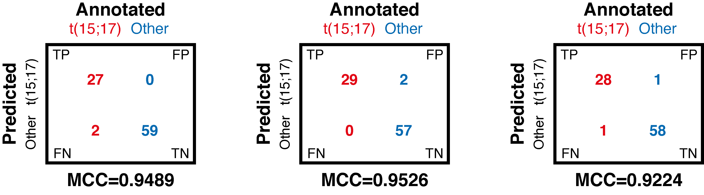
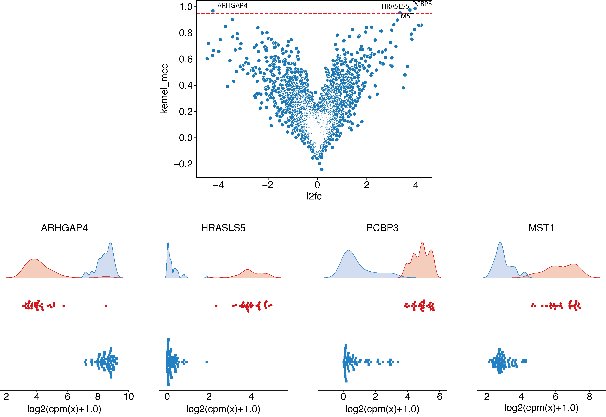
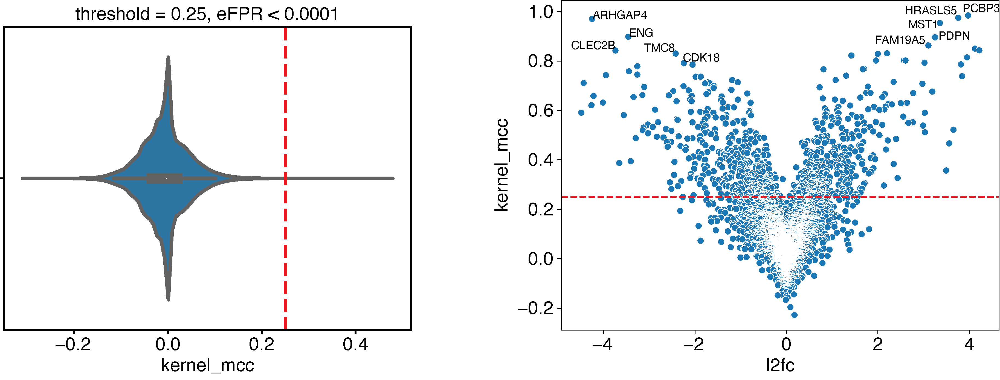

How to explore EPCY output to select best candidates
====================================================

EPCY output is comparable to statistical (or differential) analysis,
except that p-values are replaced by a predictive score (`MCC`_ by default, see
`predictive scores <https://epcy.readthedocs.io/en/latest/predictive_capability_columns.html#predictive-scores>`_).
Consequently most tools already developed to explore statistical output
can be transpose to explore EPCY output, starting by the volcano plot.

Volcano plot
------------

Using same data and analysis made in `First steps with EPCY <https://epcy.readthedocs.io/en/latest/basic_usage.html>`_, we can
create a volcano plot like this:

.. code:: bash

   # If not done, start by downloading data and scripts from epcy_tuto
   git clone git@github.com:iric-soft/epcy_tuto.git
   cd epcy_tuto/data/leucegene

   # Run EPCY analysis with --ttest to add a pvalue column
   # (see Details in predictive capability columns section)
   epcy pred_rna --log --cpm -t 4 -m readcounts.xls --ttest -d design.txt --condition AML --query t15_17 -o ./29_t15_17_vs_59/ --randomseed 42

   # Display volcano plot using MCC
   python ../../script/volcano.py -i ./29_t15_17_vs_59/predictive_capability.xls -o ./29_t15_17_vs_59/

   # Display volcano plot using pvalue
   python ../../script/volcano.py -i ./29_t15_17_vs_59/predictive_capability.xls -o ./29_t15_17_vs_59/ --pvalue

.. image:: images/volcano.png
  :width: 800px
  :alt: gene profiles
  :align: center

Identify a threshold
--------------------

Generally, the next step is to identify a `MCC`_ threshold to select best
candidates.

In case the expected predicted performance to reach is known, we can use it
directly as a threshold. For example, if we can accept a maximum of 3% of
misclassified samples (or 2 samples in this case), summarized by these three
contingency tables (`CT`_):

Using these three theoretical cases, we can identify that a `MCC`_
threshold of more than 0.95 is needed and identify the 4 genes which satisfy the
objective previously defined:

.. code:: bash

   # Display volcano plot using MCC
   python ../../script/volcano.py -t 0.95 -i ./29_t15_17_vs_59/predictive_capability.xls -o ./29_t15_17_vs_59/ --anno ./ensembl_anno_GRCh38_94.tsv
   epcy profile_rna --log --cpm -m readcounts.xls -d design.txt --condition AML --query t15_17 -o ./29_t15_17_vs_59/profile_cutoff/ --ids ENSG00000173531.15 ENSG00000168004.9 ENSG00000089820.15 ENSG00000183570.16

In case the expected performance is directly formulate using predictive scores
(as accuracy, sensibility, specificity or other), this is even simpler.
We can add these scores to the *epcy pred* command line (see
`predictive scores <https://epcy.readthedocs.io/en/latest/predictive_capability_columns.html#predictive-scores>`_)
to be able to filter EPCY's output on each of them.

Using empirical False Positive Rate
-----------------------------------

Now, when we have no expectation and want select all genes (features) with a
"significant" predictive score, we can use the **-\-shuffle** option of
*epcy pred* to compute predictive scores on random designs similar to our initial
experiment. Using several **shuffled analyses**, we can estimate a
null distribution and use it to identify a threshold, according to a percentage
of accepted False Positive Rate (`FPR`_):

.. code:: bash

   # Take around 80 min using a macbook pro 2 GHz Dual-Core Intel Core i5.
   for n in `seq 1 10`; do epcy pred_rna --log --cpm -t 4 -m readcounts.xls  -d design.txt --condition AML --query t15_17 --shuffle -o ./29_t15_17_vs_59/shuffled/$n; done

   # Display:
   #  - the MCC distribution computed on shuffled analyses
   #  - the cutoff for eFPR < 0.0001
   python ../../script/eFPR.py -d ./29_t15_17_vs_59/shuffled/ -o ./29_t15_17_vs_59/ -p 0.0001

   # Display volcano plot with a threshold = 0.25
   python ../../script/volcano.py -t 0.25 -i ./29_t15_17_vs_59/predictive_capability.xls -o ./29_t15_17_vs_59/ --anno ./ensembl_anno_GRCh38_94.tsv

.. _FPR: https://en.wikipedia.org/wiki/False_positive_rate
.. _CT: https://en.wikipedia.org/wiki/Contingency_table
.. _MCC: https://en.wikipedia.org/wiki/Matthews_correlation_coefficient
