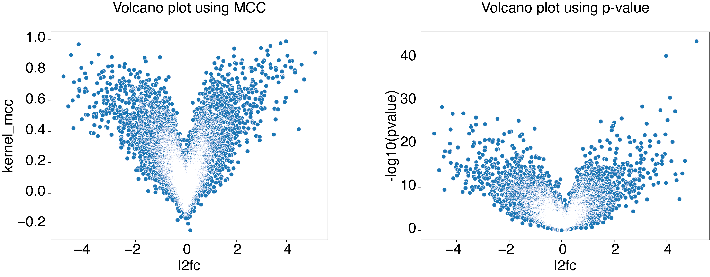
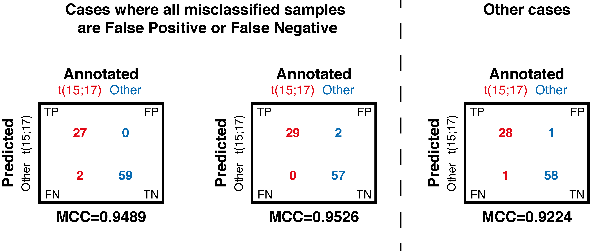

How to explore EPCY output to select best candidates
====================================================

EPCY output is comparable to statistical (or differential) analysis,
except that p-values are replace by a predictive score (MCC by default, see
`predictive score <https://epcy.readthedocs.io/en/latest/predictive_capability_columns.html#predictive-scores>`_).
Consequently most of tools already developed to explore statistical output
can be transpose to explore EPCY output, starting by the volcano plot.

Volcano plot
------------

Using same data and analysis made in `First steps with EPCY <https://epcy.readthedocs.io/en/latest/basic_usage.html>`_, we can
create a volcano plot like this:

.. code:: bash

   # If not done, start by DL data and scripts from epcy_tuto git repository
   git clone git@github.com:iric-soft/epcy_tuto.git
   cd epcy_tuto/data/leucegene

   # Run EPCY analysis with --ttest to add a pvalue column
   # (see Details in predictive capability columns section)
   epcy pred_rna --log --cpm -t 4 -m readcounts.xls --ttest -d design.txt --condition AML --query t15_17 -o ./29_t15_17_vs_59/ --randomseed 42

   # Display volcano plot using MCC
   python ../../script/volcano.py -i ./29_t15_17_vs_59/predictive_capability.xls -o ./29_t15_17_vs_59/

   # Display volcano plot using pvalue
   python ../../script/volcano.py -i ./29_t15_17_vs_59/predictive_capability.xls -o ./29_t15_17_vs_59/ --pvalue

Identify a threshold
--------------------

Generally, the next step is to identify a threshold on MCC to select best
candidates.

In case you know the expected predicted performance to reach, you can use it
directly as threshold. For example, if you can accept a maximum of 3% of (or 2)
miss classified samples, resumed by this three contingency tables:

We can identify that a threshold of MCC > 0.95 is needed. Indeed, using this
threshold, we can identify 4 genes which satisfy the objective previously
fixed:

.. code:: bash

   # Display volcano plot using MCC
   python ../../script/volcano.py -t 0.95 -i ./29_t15_17_vs_59/predictive_capability.xls -o ./29_t15_17_vs_59/ --anno ./ensembl_anno_GRCh38_94.tsv
   epcy profile_rna --log --cpm -m readcounts.xls -d design.txt --condition AML --query t15_17 -o ./29_t15_17_vs_59/profile_cutoff/ --ids ENSG00000173531.15 ENSG00000168004.9 ENSG00000089820.15 ENSG00000183570.16

In case that expected performance is directly formulate using predictive scores
(as accuracy, sensibility, specificity or other), this is even more simple.
Add these scores to the *epcy pred* command line (see `predictive score <https://epcy.readthedocs.io/en/latest/predictive_capability_columns.html#predictive-scores>`_)
to be allow to filter EPCY output, on each of them.

Using empirical False Positive Rate
-----------------------------------

Now, when we have no expectation and want select all genes (features) with a
"significant" predictive score, you can use **-\-shuffle** option of
*epcy pred* to compute predictive scores on random design similar to your
experiment. Using several **shuffled analyses**, we can estimate a
null distribution and use it to identify a threshold, according to a percentage
of False Positive Rate (`FPR`_) accepted:

.. code:: bash

   # Take around 80 min using a macbook pro 2 GHz Dual-Core Intel Core i5.
   for n in `seq 1 10`; do epcy pred_rna --log --cpm -t 4 -m readcounts.xls  -d design.txt --condition AML --query t15_17 --shuffle -o ./29_t15_17_vs_59/shuffled/$n; done

   # Display:
   #  - the MCC distribution computed on shuffled analyses
   #  - the cutoff for eFPR < 0.0001
   python ../../script/eFPR.py -d ./29_t15_17_vs_59/shuffled/ -o ./29_t15_17_vs_59/ -p 0.0001

   # Display volcano plot with a threshold = 0.25
   python ../../script/volcano.py -t 0.25 -i ./29_t15_17_vs_59/predictive_capability.xls -o ./29_t15_17_vs_59/ --anno ./ensembl_anno_GRCh38_94.tsv

.. _FPR: https://en.wikipedia.org/wiki/False_positive_rate
