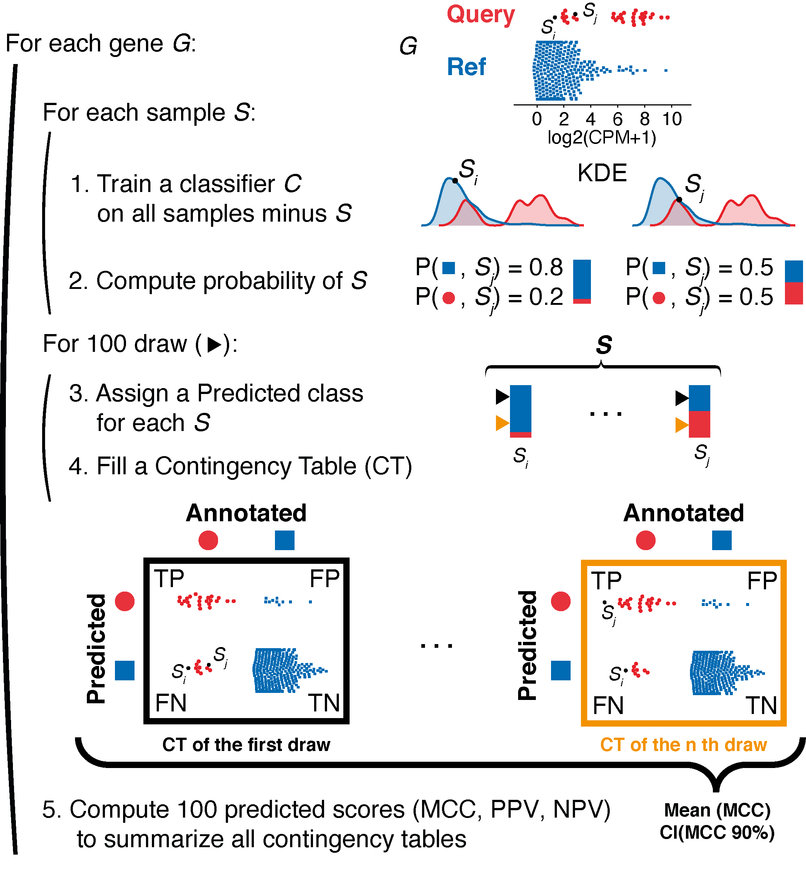

How EPCY works
==============

EPCY is a general method to rank genes (or features) according to their
potential as predictive (bio)markers, using quantitative data (like
gene expression).

Visual description of the method implemented in EPCY
----------------------------------------------------

EPCY evaluates each gene’s predictive capacity through a leave-one-out
cross-validation protocol. Subgroup densities are first modeled by a Kernel
Density Estimation (`KDE`_) and used as part of a classifier Ckde on all
samples minus one. Then Ckde is used to compute the probability of each class
of the removed sample. This procedure is repeated for each sample.
Next, we fill a contingency table (`CT`_) by randomly drawing,
for each sample, a predicted class according to the classifier’s probability.
This procedure is repeated *m* times to create *m* CTs (*m* = 100 by default).
Finally, a Matthew's correlation coefficient (`MCC`_) is computed for
each `CT`_ and these values are summarized as a mean `MCC`_ with a confidence
interval (CI).

EPCY can also reports other `predictive scores <https://epcy.readthedocs.io/en/latest/predictive_capability_columns.html#predictive-scores>`_.

.. _KDE: https://en.wikipedia.org/wiki/Kernel_density_estimation
.. _MCC: https://en.wikipedia.org/wiki/Matthews_correlation_coefficient
.. _CT: https://en.wikipedia.org/wiki/Contingency_table
