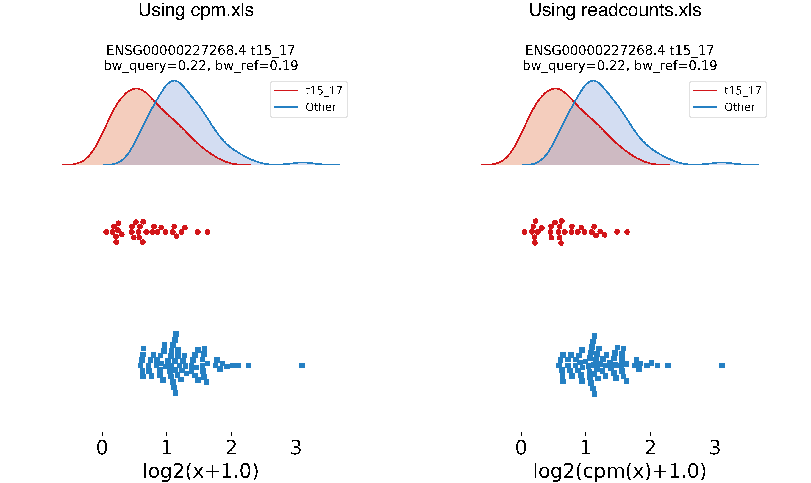

Working on RNA quantification
=============================

In contrast to most Differential Expression methods specifically
designed to analyse RNA quantification data, EPCY is a generic method
that can be used to analyse several types of quantification data,
similarly to statistical tests. However, EPCY provides specific tools,
*pred_rna* and *profile_rna*, to streamline the analysis of RNA data.

bulk RNA
--------

In the `First steps with EPCY <https://epcy.readthedocs.io/en/latest/basic_usage.html>`_,
we saw how to run EPCY on normalized quantitative
data. However, EPCY can work directly on read counts, using *pred_rna* tool:

.. code:: bash

   # The commande seen in first steps sections
   epcy pred --log -t 4 -m cpm.xls  -d design.txt --subgroup AML --query t15_17 -o ./30_t15_17_vs_70/ --randomseed 42
   # Equivalent analysis using read counts quantification and pred_rna
   epcy pred_rna --cpm --log -t 4 -m readcounts.xls  -d design.txt --subgroup AML --query t15_17 -o ./30_t15_17_vs_70_readcounts/ --randomseed 42

Similarly, you can use *profile_rna* to plot a trained KDE with its
gene expression distribution, directly from read counts:

.. code:: bash

  # The commande seen in first steps sections
  epcy profile --log -m cpm.xls -d design.txt --subgroup AML --query t15_17 -o ./30_t15_17_vs_70/figures/ --ids ENSG00000162493.16 ENSG00000227268.4

  # Equivalent commande using read counts and profile_rna
  epcy profile_rna --cpm --log -m readcounts.xls -d design.txt --subgroup AML --query t15_17 -o ./30_t15_17_vs_70_readcounts/figures/ --ids ENSG00000162493.16 ENSG00000227268.4

More help can be found using:

.. code:: bash

  epcy pred_rna -h
  epcy profile_rna -h

Kallisto quantification
-----------------------

EPCY allows to work directly on `kallisto`_ [#]_ transcript
quantifications using the HDF5 files to take into consideration the
expression values of bootsrapped samples computed by this software.
To do so, a `kallisto` column needs to be added to the design file
(which specifies the directory path of the *abundant.h5* file for each
sample).

Using data available on `git`_ and **epcy pred_rna**, you can run EPCY
as follow:

.. code:: shell

  # To run on kallisto quantification, add --kall --cpm --log
  epcy pred_rna --kal --cpm --log -d ./data/small_leucegene/5_inv16_vs_5/design.tsv -o ./data/small_leucegene/5_inv16_vs_5/trans/
  # Note that:
  # - kallisto quantification is on transcript, not on gene
  # - On real (complet) dataset, it is recommended to add some threads (-t)

To analyse gene level expression, a gff3 file of the genome annotation
needs to be specified, to provide the correspondence between
transcript and gene ids. For the Leucegene toy dataset, which was
quantified using Ensembl annotatiosn, this file can be downloaded from
`ensembl`_ and added in the command, as follow:

.. code:: shell

  # To run on kallisto quantification and gene level, add --gene --anno [file.gff]
  epcy pred_rna --kal --cpm --log --gene --anno ./data/small_genome/Homo_sapiens.GRCh38.84.reduce.gff3 -d ./data/small_leucegene/5_inv16_vs_5/design.tsv -o ./data/small_leucegene/5_inv16_vs_5/gene/ --randomseed 42
  epcy profile_rna --kal --cpm --log --gene --anno ./data/small_genome/Homo_sapiens.GRCh38.84.reduce.gff3 -d ./data/small_leucegene/5_inv16_vs_5/design.tsv -o ./data/small_leucegene/5_inv16_vs_5/gene/figures --ids ENSG00000100345
  # If you prefer analyse your data on tpm, replace --cpm by --tpm

To take account the inferential variance (introduced by `sleuth`_ [#]_), EPCY can use
bootstrapped samples, using -\-bs:

.. code:: shell

  epcy pred_rna --kal --cpm --log --gene --bs 10 --anno ./data/small_genome/Homo_sapiens.GRCh38.84.reduce.gff3 -d ./data/small_leucegene/5_inv16_vs_5/design.tsv -o ./data/small_leucegene/5_inv16_vs_5_bs/gene/ --randomseed 42
  epcy profile_rna --kal --cpm --log --gene --bs 10 --anno ./data/small_genome/Homo_sapiens.GRCh38.84.reduce.gff3 -d ./data/small_leucegene/5_inv16_vs_5/design.tsv -o ./data/small_leucegene/5_inv16_vs_5_bs/gene/figures --ids ENSG00000100345

When reading all kallisto files is time consuming, you can use *epcy kal2mat*
tool, to create a quantification matrix file and use EPCY, as before:

.. code:: shell

  # Without bootstrapped samples
  epcy kal2mat --gene --anno ./data/small_genome/Homo_sapiens.GRCh38.84.reduce.gff3 -d ./data/small_leucegene/5_inv16_vs_5/design.tsv -o ./data/small_leucegene/5_inv16_vs_5_mat/gene/
  epcy pred_rna --cpm --log -d ./data/small_leucegene/5_inv16_vs_5/design.tsv -m ./data/small_leucegene/5_inv16_vs_5_mat/gene/readcounts.xls -o ./data/small_leucegene/5_inv16_vs_5_mat/gene/ --randomseed 42
  epcy profile_rna --cpm --log -m ./data/small_leucegene/5_inv16_vs_5_mat/gene/readcounts.xls -d ./data/small_leucegene/5_inv16_vs_5/design.tsv -o ./data/small_leucegene/5_inv16_vs_5_mat/gene/figures --ids ENSG00000100345

  # With bootstrapped samples
  epcy kal2mat --gene --bs 10 --anno ./data/small_genome/Homo_sapiens.GRCh38.84.reduce.gff3 -d ./data/small_leucegene/5_inv16_vs_5/design.tsv -o ./data/small_leucegene/5_inv16_vs_5_mat_bs/gene/
  epcy pred_rna --bs 10 --cpm --log -d ./data/small_leucegene/5_inv16_vs_5/design.tsv -m ./data/small_leucegene/5_inv16_vs_5_mat_bs/gene/readcounts.xls -o ./data/small_leucegene/5_inv16_vs_5_mat_bs/gene/ --randomseed 42
  epcy profile_rna --bs 10 --cpm --log -m ./data/small_leucegene/5_inv16_vs_5_mat_bs/gene/readcounts.xls -d ./data/small_leucegene/5_inv16_vs_5/design.tsv -o ./data/small_leucegene/5_inv16_vs_5_mat_bs/gene/figures --ids ENSG00000100345

Single-cell
-----------

Several developments are planned in order to facilitate the use of
EPCY for single-cell data (to manage sparse matrix and run on GPU for
instance). In the meantime, you can analyse your single-cell data with
*epcy pred* and *epcy profile* using the RNA-seq pipeline described in
`First steps with EPCY <https://epcy.readthedocs.io/en/latest/basic_usage.html>`_
on normalized expression data.

On read counts (not normalized), you can use *epcy pred_rna* and
*epcy profile_rna* with -\-cpmed (in place of -\-cpm) to normalized read
counts according to median depth of the dataset.

.. code:: shell

  epcy pred_rna --cpmed --log ...

.. [#] Nicolas L Bray, Harold Pimentel, Páll Melsted and Lior Pachter, |kallisto_title|_, Nature Biotechnology **34**, 525–527 (2016), doi:10.1038/nbt.3519
.. [#] Harold J. Pimentel, Nicolas Bray, Suzette Puente, Páll Melsted and Lior Pachter, |sleuth_title|_, Nature Methods (2017), advanced access http://dx.doi.org/10.1038/nmeth.4324

.. |kallisto_title| replace:: Near-optimal probabilistic RNA-seq quantification
.. _kallisto_title : https://www.nature.com/articles/nbt.3519

.. |sleuth_title| replace::  Differential analysis of RNA-Seq incorporating quantification uncertainty
.. _sleuth_title : https://www.nature.com/articles/nmeth.4324

.. _kallisto: https://pachterlab.github.io/kallisto
.. _git: https://github.com/iric-soft/epcy/tree/master/data/small_leucegene/5_inv16_vs_5/
.. _ensembl: https://useast.ensembl.org/info/data/ftp/index.html
.. _sleuth: https://pachterlab.github.io/sleuth
